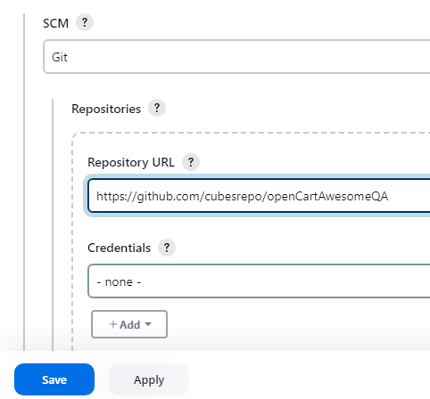

**Hello**🖐 **Automated Testing for opencartAwesomeQA Demo Website with (Selenium, Pytest, Page Object Model (POM), Allure Reports, Jenkins Pipeline)**

This project automates the testing of the ReactShoppingCart demo site, focusing on essential user journeys such as valid registration, successful login, adding items to the cart, using the wishlist, and completing a full checkout flow.
Aside from the main flow, I also tested several edge cases to make sure the system handles unusual user actions properly. 
These include:
   - Registering with empty or incomplete fields 
   - Logging in with missing credentials 
   - Checking out with an empty cart 
   - Removing items from an empty wishlist 
   - Attempting to complete checkout without providing any billing details

___________________________________________

🎯 **Pre-requisites:**
- Python 3.11.9
- Any browsers(Chrome, Firefox, Edge)
___________________________________________

▶ **Test Execution**

Run commands: 
1. Install Dependecies:

       pip install -r requirements.txt
2. Run the test with Allure report:

       pytest -v --alluredir=reports/TestCase1
   or specifying browser

       pytest -v --browser=edge --alluredir=reports/TestCase1
    

**To run this on jenkins**
1. Add item name, click Pipeline and click OK
    
    
2. Scroll down and navigate to Pipeline then select "pipeline script from SCM"
    
   
3. Select Git
    
   
4. Paste the Repo URL and click Apply and Save
    
   
5. Click build now
    
   

    
   
   
    
